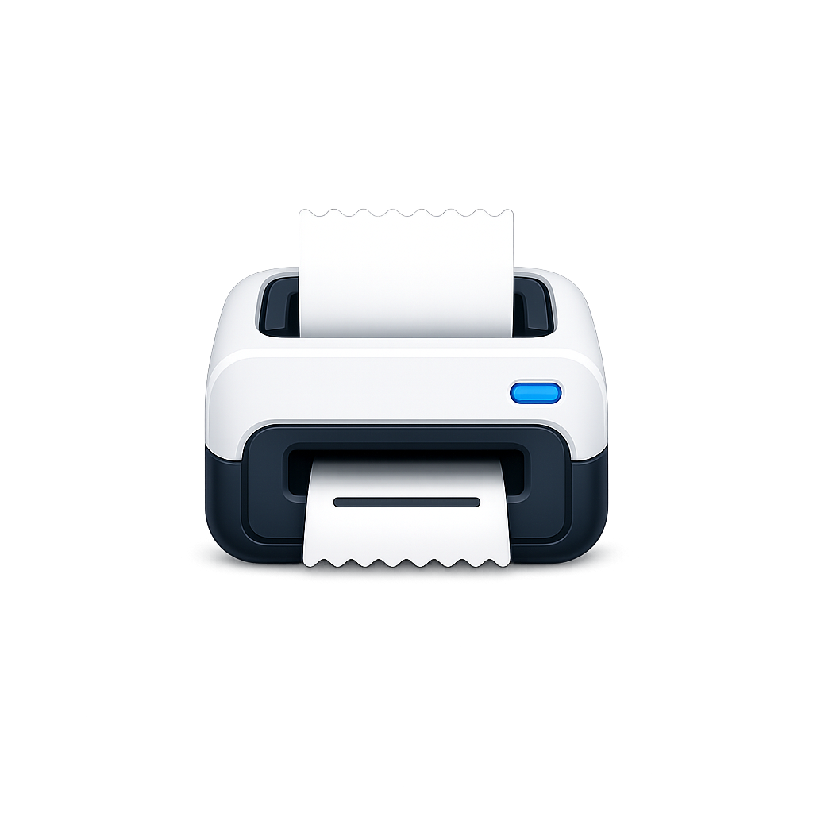
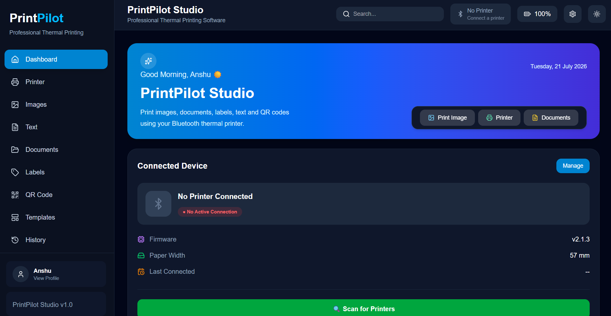
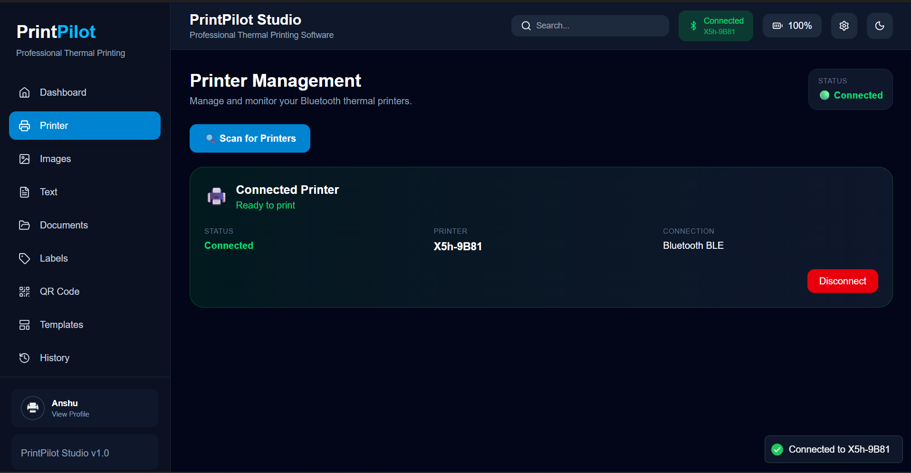
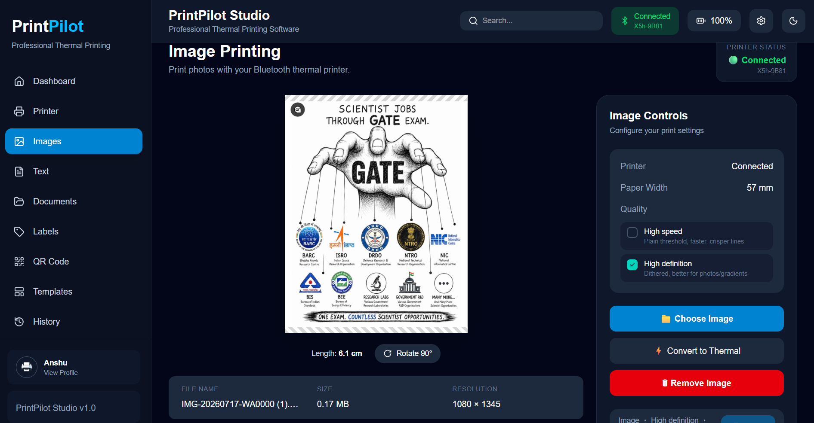
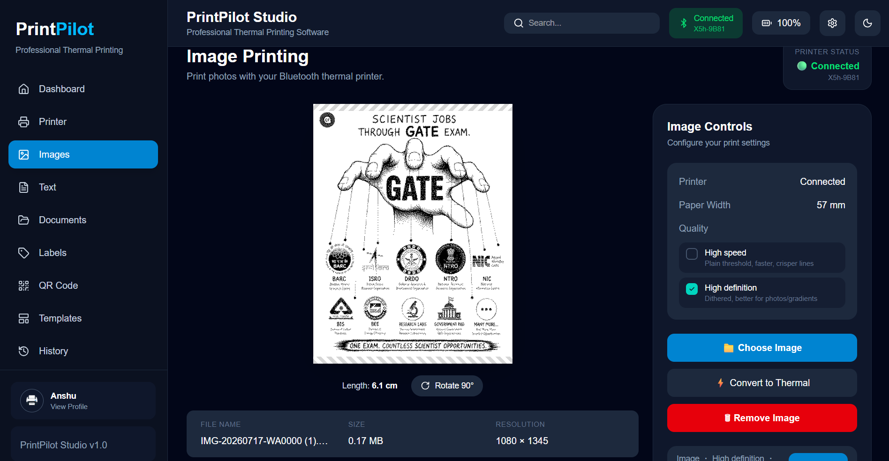

<div align="center">



# PrintPilot Studio

### Modern Desktop Software for Bluetooth Thermal Printers

Print images, labels, QR codes, text, and receipts with ease using a modern desktop application built for ESC/POS compatible Bluetooth thermal printers.


</div>

---

## 📸 Dashboard

<p align="center">

</p>

---

# 🚀 Overview

PrintPilot Studio is a modern desktop application designed for Bluetooth thermal printers. It combines a clean and intuitive user interface with powerful printing capabilities, making it easy to print images, labels, QR codes, text, and receipts from a single application.

Built with **React**, **TypeScript**, **Rust**, and **Tauri**, PrintPilot Studio delivers native desktop performance while optimizing output for ESC/POS compatible thermal printers.

---

# ✨ Features

## 🖨 Printing

- Bluetooth thermal printer support
- Image printing with live preview
- Label printing
- QR code generation & printing
- Text printing
- Receipt printing

## ⚙ Image Processing

- Real-time thermal preview
- Floyd–Steinberg dithering
- Brightness adjustment
- Contrast adjustment
- Image rotation
- Scaling & resizing

## 💻 User Experience

- Modern desktop interface
- Native Windows application
- Fast printer discovery
- Device management
- Clean and responsive UI

---

# 📸 Screenshots

## Printer Management

<p align="center">

</p>

---

## Image Printing

<p align="center">

</p>

---

## Thermal Image Optimization

<p align="center">

</p>

---

# 🛠 Tech Stack

| Frontend | Desktop | Printing |
|-----------|----------|-----------|
| React 19 | Tauri v2 | ESC/POS |
| TypeScript | Rust | Bluetooth |
| Tailwind CSS | Vite | Image Processing |

---

# 🚀 Getting Started

## Clone the repository

```bash
git clone https://github.com/uicoder1/PrintPilot-Studio.git
```

## Install dependencies

```bash
npm install
```

## Start development

```bash
npm run tauri dev
```

## Build for production

```bash
npm run tauri build
```

---

# 🗺 Roadmap

- ✅ Bluetooth Printer Management
- ✅ Image Printing
- ✅ Label Printing
- ✅ QR Code Printing
- ✅ Text Printing
- ✅ Thermal Image Optimization
- 🔄 PDF Printing
- 🔄 Printer Profiles
- 🔄 Template Designer
- 🔄 Multi-language Support

---

# 👨‍💻 Author

**Anshu Gupta**

Software Engineering Student

- GitHub: https://github.com/uicoder1
- Portfolio: coming soon
- LinkedIn: https://www.linkedin.com/in/anshu-gupta-uicoder/

---

# 📄 License

This project is licensed under the **PrintPilot Studio Source Available License**.

See the [LICENSE](LICENSE) file for details.